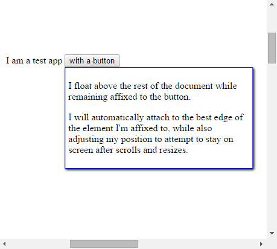
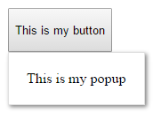

# react-float-affixed

Create popup elements that are attached to other elements (such as what you might use to implement a dropdown or menu button).

The popup is created *outside* of the regular DOM tree but is positioned to remain automatically attached to the element to which you anchor it, automatically switching which edge it is attached to in order to stay on the screen.

## Demonstration



Usage:



```jsx
<button>
    <span>This is my button</span>
    <FloatAffixed>and this is my popup</FloatAffixed>
</button>
```

Results in html that looks like this
```html
<button><span>This is my button</span></button>
```

And html elsewhere that looks like this:
```html
<div>and this is my popup</div>
```

## Advanced
More advanced usage, here's an example that shows the popup when the button is clicked

### Show and hide a popup
```jsx
<div>
    <input type="checkbox" checked={this.state.on} onClick={()=>this.setState({on:!this.state.on})}/>
    <label>This is my checkbox</label>
    {this.state.on &&
        <FloatAffixed>This is my popup</FloatAffixed>
    }
</div>
```

### Specify valid attachment edges
```jsx
<FloatAffixed attachments="over,under">...</FloatAffixed>
```
Note: edges are tried in the order specified


